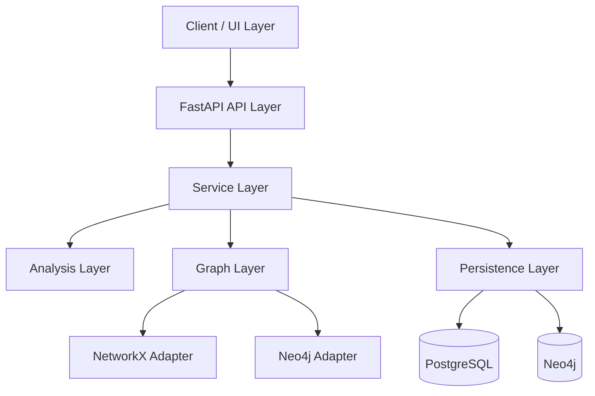
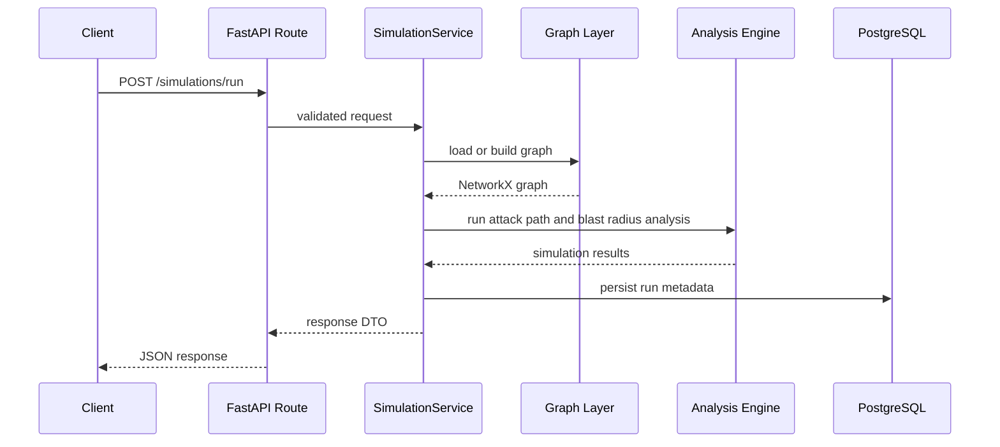

# 🏗️ LateralScope Architecture

## Overview

**LateralScope** is a backend-first cybersecurity analytics platform that models enterprise environments as directed attack graphs and simulates how adversaries move through systems via lateral movement, privilege escalation, trust relationships, and network reachability.

The platform acts as a graph-based **digital twin** for cyber risk analysis. It enables defenders to:

- identify attack paths from an initial foothold to crown-jewel assets
- quantify blast radius after compromise
- detect critical choke points
- evaluate remediation strategies before implementation

---

## Architectural Goals

LateralScope is designed around the following goals:

### 1. Separation of Concerns
API, orchestration, analysis, graph construction, and persistence are isolated into clear layers.

### 2. Deterministic Simulation
Core attack-path and blast-radius logic should be reproducible, testable, and independent of external state.

### 3. Extensibility
The platform should support future additions such as:
- MITRE ATT&CK mapping
- probabilistic simulation
- cloud IAM attack graphs
- event-based propagation

### 4. Dual Graph Strategy
LateralScope uses:
- **NetworkX** for in-memory simulation and analytics
- **Neo4j** for persistent graph storage and graph-native querying

### 5. Backend-First Design
The core product is the simulation engine and API, not the UI.

### 6. Production-Oriented Structure
The project follows a modular backend architecture suitable for testing, extension, and deployment.

---

## High-Level System Architecture



## Layered Design

### API Layer

The API layer is implemented with FastAPI.

Its responsibilities are:

- accept simulation and graph requests
- validate request payloads
- expose endpoints
- return structured JSON responses

This layer must remain thin and should not contain graph algorithms or simulation logic.

**Examples:**

```http
POST /graphs/load-sample
GET /graphs/{graph_id}/summary
POST /simulations/run
POST /remediations/evaluate
```

### Service Layer

The service layer coordinates application workflows.

Its responsibilities are:

- orchestrate graph loading
- invoke analysis engines
- transform outputs into response schemas
- manage persistence of scenarios and simulation runs

This layer acts as the boundary between API handlers and domain logic.

**Example services:**

- GraphService
- ScenarioService
- SimulationService
- RemediationService

### Analysis Layer

The analysis layer contains the mathematical and graph-based logic of the system.

Its responsibilities are:

- shortest attack path analysis
- weighted path scoring
- blast radius computation
- choke point detection
- remediation impact evaluation

This is the computational core of LateralScope.

**Planned modules:**

- `attack_path_engine.py`
- `blast_radius.py`
- `propagation_simulator.py`
- `choke_point_analysis.py`
- `remediation_optimizer.py`
- `risk_scoring.py`

### Graph Layer

The graph layer is responsible for graph construction, normalization, and adapter logic.

Its responsibilities are:

- build enterprise graphs from input data
- define canonical node and edge schemas
- normalize graph entities
- expose adapters for NetworkX and Neo4j

This ensures the rest of the system operates on a consistent graph model.

**Subcomponents:**

- `builders/`
- `loaders/`
- `adapters/`
- `types.py`

### Persistence Layer

LateralScope separates workflow persistence from graph persistence.

#### PostgreSQL

Used for:

- scenario definitions
- simulation runs
- remediation runs
- summary metrics
- audit-friendly result storage

#### Neo4j

Used for:

- persistent graph storage
- relationship-heavy queries
- future graph-native exploration using Cypher

This split allows:

- relational storage for workflow state
- graph-native storage for topology and relationships

### Core Request Flow

A typical simulation request moves through the system in this order:



## Canonical Domain Model

LateralScope models the enterprise as a directed attack graph.

#### Node Categories

- **Identity Nodes**: Represent actors and permission-bearing entities.
  - user
  - service account
  - admin group
  - privileged role
- **Host Nodes**: Represent compute infrastructure.
  - workstation
  - application server
  - database server
  - domain controller
- **Data Asset Nodes**: Represent sensitive storage or business systems.
  - SQL database
  - object store
  - backup repository
  - secrets vault
- **Network Nodes**: Represent segmentation or connectivity boundaries.
  - subnet
  - VLAN
  - security zone
- **Crown Jewel Nodes**: Represent high-value compromise targets.
  - domain controller
  - production database
  - backup server
  - critical application

## Edge Categories

Edges represent attacker-usable relationships or capabilities.

### Identity and Privilege Edges

- `MEMBER_OF`
- `ADMIN_ON`
- `DELEGATED_ADMIN`
- `TRUSTS`

### Session and Credential Edges

- `HAS_SESSION`
- `CAN_IMPERSONATE`

### Lateral Movement Edges

- `CAN_RDP_TO`
- `CAN_SSH_TO`
- `CAN_WINRM_TO`

### Network Reachability Edges

- `NETWORK_REACHABLE`
- `ROUTES_TO`

### Exploitability Edges

- `EXPLOITS`
- `VULNERABLE_TO`

## Edge Attributes

Each edge may include:

- `edge_type`
- `weight`
- `difficulty`
- `detectability`
- `exploitability`
- `required_privilege`

These attributes allow the graph to capture not only connectivity, but also attacker effort and defensive visibility.

## Graph Modeling Strategy

LateralScope uses a directed, weighted graph.

### Why Directed?

Attack movement is often asymmetric.

- host A may reach host B, but not the reverse
- a user may administer a server, but that server does not administer the user

### Why Weighted?

Not all attack steps are equally easy or equally risky.

Weights represent assumptions such as:

- exploit complexity
- privilege requirements
- detection likelihood
- expected attacker effort

This allows shortest-path algorithms to compute the most attractive attacker routes.

## Mathematical Model

### Attack Path Cost

For a path P, total attack cost is the sum of edge weights:

```python
Cost(path) = sum(weight(e) for e in path)
```

This is used to compute:

- shortest attack paths
- lowest-cost compromise routes
- defender-visible high-risk paths

### Blast Radius

For a compromised node n, blast radius is the set of all reachable nodes:

```python
BlastRadius(n) = all nodes reachable from n
```

This can be extended with weighted asset values to reflect business impact.

### Choke Point Importance

Choke points are nodes or edges that appear across many high-value attack paths.

They can be measured using:

- betweenness centrality
- path frequency
- target-specific path coverage

### Remediation Impact

A remediation action is valuable if it reduces attacker reachability or increases attack cost.

```python
DeltaRisk = ReachableNodesBefore - ReachableNodesAfter
```

Additional remediation metrics may include:

- reduction in number of valid attack paths
- increase in minimum path cost
- isolation of crown-jewel assets

## Example Attack Scenario

A representative scenario may look like this:

1. attacker compromises a workstation via phishing
2. attacker obtains local admin privileges
3. attacker moves laterally to a server using RDP
4. attacker exploits a trust relationship
5. attacker reaches a domain controller
6. attacker accesses a sensitive database

LateralScope should be able to:

- identify all possible paths
- compute the lowest-cost path
- measure blast radius
- highlight choke points
- evaluate remediation actions that disrupt the path

## Code Structure Mapping

```markdown
lateralscope/
├── app/
│   ├── api/                # FastAPI routes
│   ├── services/           # orchestration layer
│   ├── analysis/           # graph algorithms and simulation logic
│   ├── graph/              # graph builders, loaders, and adapters
│   ├── schemas/            # request/response models
│   ├── models/             # database models
│   ├── db/                 # DB session and initialization
│   └── core/               # config, logging, shared settings
│
├── data/                   # synthetic datasets and fixtures
├── tests/                  # unit and scenario tests
├── docker/                 # Docker assets
├── docker-compose.yml
├── README.md
└── ARCHITECTURE.md
```

## Design Decisions

### Why FastAPI?

FastAPI provides:

- strong request validation
- clean async-ready API design
- automatic OpenAPI documentation
- a modern backend development experience

### Why NetworkX?

NetworkX is ideal for:

- in-memory graph construction
- shortest-path computation
- reachability analysis
- centrality metrics
- rapid analytical iteration

### Why Neo4j?

Neo4j is valuable for:

- persistent graph storage
- relationship-heavy querying
- future Cypher-powered graph inspection

### Why PostgreSQL?

PostgreSQL provides durable storage for:

- scenarios
- simulation metadata
- run history
- metrics and summaries

## Future Extensions

### MITRE ATT&CK Mapping

Map graph edges and attack steps to ATT&CK tactics and techniques.

### Probabilistic Simulation

Introduce probabilities for:

- exploit success
- defender detection
- lateral movement success

### Cloud IAM Graphs

Extend the graph model to support:

- AWS IAM attack paths
- Azure AD privilege chains
- cloud identity trust relationships

### Event-Based Simulation

Model compromise propagation over time instead of only static reachability.

### UI Layer

Add a frontend using:

- Streamlit for fast analytical dashboards
- React for a richer application interface

## Key Design Insight

LateralScope is not a vulnerability scanner.

It is a graph-based attack propagation and decision-support engine.

It answers the question:

> If this node is compromised, how far can an attacker go, and which defensive action cuts off the most risk?

## Summary

LateralScope combines:

- graph theory
- cybersecurity modeling
- simulation logic
- backend architecture

to build a serious platform for attack path analysis, blast radius estimation, and remediation planning.