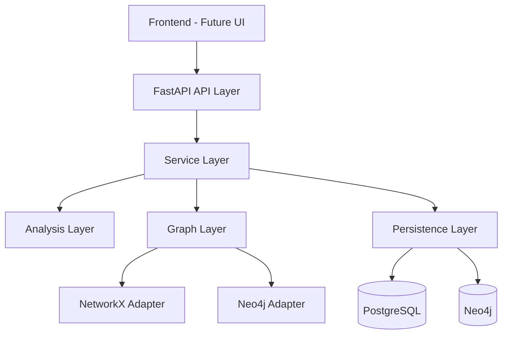

# 🚨 LateralScope

A graph-based engine for simulating adversarial movement and quantifying blast radius in enterprise environments.

[](https://python.org)
[](https://fastapi.tiangolo.com)
[](LICENSE)

## Graph-Based Cyber Attack Path & Blast Radius Simulator

LateralScope is a specialized cybersecurity Digital Twin platform that models enterprise environments as directed attack graphs. 

It simulates how adversaries move through infrastructure via:

- **lateral movement**
- **privilege escalation**
- **network reachability**

## 🎯 The Mission

In modern infrastructure, initial access is rarely the end-game.

The real risk lies in:

- **uncontrolled lateral movement and privilege chaining**

Traditional security tools often miss the connective tissue between:

- **a minor vulnerability**
- **and a full-scale compromise**

LateralScope applies graph theory to:

- Map relationships between identities, infrastructure, and network topology
- Predict attacker paths to crown-jewel assets
- Quantify risk reduction before applying security controls

## 🧠 Core Ontology (Attack Graph Model)

LateralScope represents the enterprise as a directed graph.

### Node Types
- 👤 **Identity** (User, Service Account)
- 💻 **Host** (Workstation, Server)
- 🗄️ **Data Store** (Database, Object Storage)
- 🌐 **Network Zone** (Subnet, VLAN)
- 💎 **Crown Jewel** (Domain Controller, Critical Systems)

### Edge Types (Attack Capabilities)
- `MEMBER_OF` → group/role membership
- `ADMIN_ON` → privilege escalation
- `HAS_SESSION` → credential exposure
- `CAN_RDP_TO` / `CAN_SSH_TO` → lateral movement
- `NETWORK_REACHABLE` → connectivity
- `EXPLOITS` → vulnerability-based access

## ⚙️ Key Features

### 🔍 Attack Path Discovery
- Dijkstra / A* based shortest-path analysis
- Multiple attack path enumeration
- Stepwise adversary progression

### 💥 Blast Radius Analysis
- Reachability analysis from compromised nodes
- Multi-step propagation modeling
- Critical asset exposure detection

### 🎯 Choke Point Detection
- Betweenness centrality-based analysis
- Identifies high-impact nodes and edges

### 🛡️ Remediation Modeling
- Simulate removal of edges (privileges, vulnerabilities)
- Measure graph-wide risk reduction

## 🔬 What Makes LateralScope Different

Unlike traditional security tools that focus on detection or isolated vulnerabilities, LateralScope:

- Models the **entire attack surface as a graph**
- Focuses on **attack propagation**, not just entry points
- Simulates **real attacker movement paths**
- Quantifies **risk reduction before implementing controls**
- Bridges **graph theory + cybersecurity + simulation**

This makes it closer to **attack graph research systems** than conventional security tools.

## 🏗️ Architecture

The system is designed as a backend-first cyber analytics engine.



### 🧮 Mathematical Modeling

#### Attack Path Cost
Each edge is assigned a weight representing:

- exploitation difficulty  
- detection likelihood  
- required privileges  

```
Attack Cost = Σ (D_e × R_e)
```

#### Blast Radius
```
BlastRadius(node) = set of all reachable nodes
```

#### Remediation Impact
```
ΔRisk = ReachableNodes_before − ReachableNodes_after
```

## 🧪 Example Scenario

1. Attacker compromises a workstation via phishing  
2. Gains local administrative privileges  
3. Moves laterally to a server using RDP  
4. Exploits a trust relationship  
5. Reaches a domain controller  
6. Accesses sensitive database  

**LateralScope will:**
- Identify all possible attack paths  
- Compute the lowest-cost path  
- Measure blast radius  
- Highlight critical choke points  
- Recommend high-impact remediation actions  

## 🛠️ Tech Stack

### Core
- **Python 3.12+**
- **FastAPI**
- **Pydantic v2**

### Graph Processing
- **NetworkX** (simulation engine)
- **Neo4j** (persistent graph database)

### Data Layer
- **PostgreSQL**
- **SQLAlchemy + Alembic**

### Dev & Infra
- **Docker / Docker Compose**
- **Pytest**
- **GitHub Actions**

## 📁 Project Structure

```
lateralscope/
├── app/
│   ├── api/              # FastAPI routes
│   ├── services/         # orchestration layer
│   ├── analysis/         # attack path & simulation logic
│   ├── graph/            # graph builders & adapters
│   ├── schemas/          # request/response models
│   ├── models/           # database models
│   ├── db/               # database setup
│   └── core/             # config & logging
├── data/                 # synthetic & test datasets
├── tests/                # unit & scenario tests
├── docker/               # Docker configs
├── docker-compose.yml
└── README.md
```

## 🚀 Getting Started

### 1. Clone & Setup
```bash
git clone https://github.com/jithinmathws/cyber-attack-simulator.git
cd cyber-attack-simulator

python -m venv .venv
source .venv/bin/activate   # Linux/macOS
.venv\Scripts\activate      # Windows

pip install -r requirements.txt
```

### 2. Start Infrastructure
```bash
docker-compose up -d
```
> Starts PostgreSQL + Neo4j

### 3. Run API
```bash
uvicorn app.main:app --reload
```

### 4. Open API Docs
Visit: http://localhost:8000/docs

## 🗺️ Roadmap

- **Phase 1** — Core graph modeling & NetworkX engine
- **Phase 2** — MITRE ATT&CK mapping
- **Phase 3** — Probabilistic attack simulation (Monte Carlo)
- **Phase 4** — Cloud IAM attack graph (AWS / Azure)
- **Phase 5** — Interactive visualization layer

## 💡 Why This Project Matters

LateralScope demonstrates:

- Graph-based system design
- Cybersecurity attack modeling
- Simulation-driven analytics
- Backend engineering with FastAPI
- Real-world problem solving

## 📌 Portfolio Positioning

This project positions you as someone who can build:

- Cybersecurity analytics platforms
- Graph-based simulation engines
- Attack path analysis systems
- Production-grade backend architectures

## 🧑‍💻 Author

**Jithin Mathews**

## ⭐ Final Note

This is not just a project.

It is a graph-based cyber attack propagation and simulation engine — the same class of systems used in real-world security engineering.

---

## 📄 License

This project is licensed under the MIT License - see the [LICENSE](LICENSE) file for details.

## 🤝 Contributing

Contributions are welcome! Please feel free to submit a Pull Request.